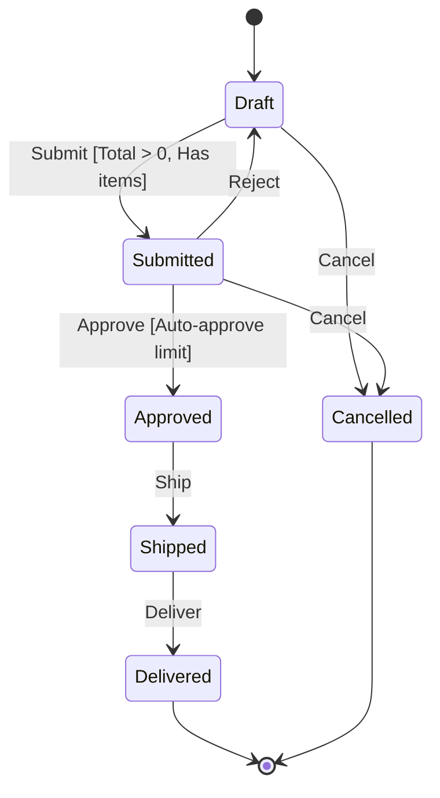

import { Callout } from 'fumadocs-ui/components/callout';

The state machine package models **entities with well-defined lifecycles** (Order, Payment, Ticket, Subscription, etc.) where state transitions are explicit, validated, and auditable.

<Callout type="info">
**State Machine vs Saga**: Sagas orchestrate multi-step distributed processes. State machines govern the lifecycle of a single entity over time with strict transition rules.
</Callout>

## Installation

```bash
dotnet add package TurboMediator.StateMachine
dotnet add package TurboMediator.StateMachine.EntityFramework  # Optional: EF Core transition store
```

## Concepts

| Concept | Description |
|---|---|
| **State** | A named position in the entity lifecycle (enum value) |
| **Trigger** | An event that causes a transition (enum value) |
| **Guard** | A condition that must be true for a transition to be allowed |
| **Entry/Exit Action** | Code that runs when entering or leaving a state |
| **Final State** | A state with no outgoing transitions (terminal) |
| **Transition Store** | Persists transition history for auditing |

## Defining States and Triggers

Use enums to define all possible states and triggers:

```csharp
public enum OrderStatus
{
    Draft, Submitted, Approved, Shipped, Delivered, Cancelled
}

public enum OrderTrigger
{
    Submit, Approve, Reject, Ship, Deliver, Cancel
}
```

## Making an Entity Stateful

Implement `IStateful<TState>` on your entity:

```csharp
public class Order : IStateful<OrderStatus>
{
    public Guid Id { get; set; } = Guid.NewGuid();
    public OrderStatus CurrentState { get; set; } = OrderStatus.Draft;
    public string CustomerName { get; set; } = "";
    public decimal Total { get; set; }
    public DateTime? ApprovedAt { get; set; }
    public string? CancellationReason { get; set; }
}
```

## Defining a State Machine

Extend `StateMachine<TEntity, TState, TTrigger>` and override `Configure`:

```csharp
public class OrderStateMachine : StateMachine<Order, OrderStatus, OrderTrigger>
{
    public OrderStateMachine(IMediator mediator, ITransitionStore? transitionStore = null)
        : base(mediator, transitionStore) { }

    protected override void Configure(StateMachineBuilder<Order, OrderStatus, OrderTrigger> builder)
    {
        builder.InitialState(OrderStatus.Draft);

        builder.State(OrderStatus.Draft)
            .Permit(OrderTrigger.Submit, OrderStatus.Submitted)
                .When(order => order.Total > 0, "Total > 0")
                .When(order => order.Items.Count > 0, "Has items")
            .Permit(OrderTrigger.Cancel, OrderStatus.Cancelled);

        builder.State(OrderStatus.Submitted)
            .OnEntry(async (order, ctx) =>
            {
                await ctx.Publish(new OrderSubmittedEvent(order.Id));
            })
            .Permit(OrderTrigger.Approve, OrderStatus.Approved)
                .When(order => order.Total < 50_000, "Auto-approve limit")
            .Permit(OrderTrigger.Reject, OrderStatus.Draft)
            .Permit(OrderTrigger.Cancel, OrderStatus.Cancelled);

        builder.State(OrderStatus.Approved)
            .OnEntry(async (order, ctx) =>
            {
                order.ApprovedAt = DateTime.UtcNow;
                await ctx.Send(new ReserveInventoryCommand(order.Id));
            })
            .Permit(OrderTrigger.Ship, OrderStatus.Shipped);

        builder.State(OrderStatus.Shipped)
            .Permit(OrderTrigger.Deliver, OrderStatus.Delivered);

        builder.State(OrderStatus.Delivered)
            .AsFinal();

        builder.State(OrderStatus.Cancelled)
            .OnEntry(async (order, ctx) =>
            {
                if (ctx.Metadata.TryGetValue("reason", out var reason))
                    order.CancellationReason = reason;
                await ctx.Publish(new OrderCancelledEvent(order.Id, reason));
            })
            .AsFinal();

        builder.OnTransition(async (order, from, to, trigger) =>
        {
            // Global audit callback for every transition
            logger.LogInformation("Order {Id}: {From} → {To} via {Trigger}", order.Id, from, to, trigger);
            await Task.CompletedTask;
        });
    }
}
```

## Fluent API Reference

### StateMachineBuilder

| Method | Description |
|---|---|
| `.InitialState(state)` | Sets the initial state for new entities |
| `.State(state)` | Begins configuration for a specific state |
| `.OnTransition(callback)` | Global callback invoked on every successful transition |
| `.OnInvalidTransition(handler)` | Custom handler for disallowed triggers (default: throw) |

### StateConfiguration

| Method | Description |
|---|---|
| `.Permit(trigger, destination)` | Allows a transition via the specified trigger |
| `.OnEntry(action)` | Action to run when entering this state |
| `.OnExit(action)` | Action to run when leaving this state |
| `.AsFinal()` | Marks as terminal state (no outgoing transitions) |

### TransitionBuilder

| Method | Description |
|---|---|
| `.When(guard, description?)` | Adds a guard condition (chainable for multiple guards) |
| `.Permit(trigger, destination)` | Shortcut to add another transition from the same source state |

## Registration

### Fluent Builder (recommended)

```csharp
builder.Services.AddTurboMediator(m =>
{
    m.WithInMemoryStateMachines(sm =>
    {
        sm.AddStateMachine<OrderStateMachine, Order, OrderStatus, OrderTrigger>();
        sm.AddStateMachine<PaymentStateMachine, Payment, PaymentStatus, PaymentTrigger>();
    });
});
```

### Manual Registration

```csharp
builder.Services.AddTurboMediator(m =>
{
    m.WithStateMachines(sm =>
    {
        sm.UseStore<MyCustomTransitionStore>();  // Custom store
        sm.AddStateMachine<OrderStateMachine, Order, OrderStatus, OrderTrigger>();
    });
});
```

### Direct IServiceCollection

```csharp
builder.Services.AddInMemoryTransitionStore();
builder.Services.AddStateMachine<OrderStateMachine, Order, OrderStatus, OrderTrigger>();
```

## Firing Transitions

Inject `IStateMachine<TEntity, TState, TTrigger>` and use `FireAsync`:

```csharp
public class OrderController(IStateMachine<Order, OrderStatus, OrderTrigger> machine)
{
    [HttpPost("{id}/submit")]
    public async Task<IActionResult> Submit(Guid id)
    {
        var order = await GetOrder(id);

        var result = await machine.FireAsync(order, OrderTrigger.Submit);

        if (!result.IsSuccess)
            return BadRequest(result.Error);

        await SaveOrder(order); // Persist the updated state
        return Ok(new { result.PreviousState, result.CurrentState, result.Trigger, result.Timestamp });
    }

    [HttpPost("{id}/cancel")]
    public async Task<IActionResult> Cancel(Guid id, [FromBody] CancelRequest request)
    {
        var order = await GetOrder(id);

        // Pass metadata to entry actions
        var metadata = new Dictionary<string, string> { ["reason"] = request.Reason };
        var result = await machine.FireAsync(order, OrderTrigger.Cancel, metadata);

        if (!result.IsSuccess)
            return BadRequest(result.Error);

        await SaveOrder(order);
        return Ok(result);
    }
}
```

## TransitionResult

Every `FireAsync` call returns a `TransitionResult`:

```csharp
public class TransitionResult<TState, TTrigger>
{
    public TState PreviousState { get; }
    public TState CurrentState { get; }
    public TTrigger Trigger { get; }
    public bool IsSuccess { get; }
    public string? Error { get; }       // Null on success; guard/transition error on failure
    public DateTime Timestamp { get; }
}
```

<Callout type="info">
When a guard fails, `FireAsync` returns a failed `TransitionResult` instead of throwing. When a trigger is not defined for the current state, an `InvalidTransitionException` is thrown (unless you configure `OnInvalidTransition`).
</Callout>

## TransitionContext

Entry and exit actions receive a `TransitionContext` that provides access to the mediator:

```csharp
.OnEntry(async (entity, ctx) =>
{
    // Send commands
    await ctx.Send(new ReserveInventoryCommand(entity.Id));

    // Publish notifications
    await ctx.Publish(new OrderApprovedEvent(entity.Id));

    // Access metadata passed by the caller
    var reason = ctx.Metadata["reason"];
})
```

## Guard Conditions

Guards prevent transitions unless conditions are met. They are evaluated **before** entry/exit actions:

```csharp
builder.State(OrderStatus.Draft)
    .Permit(OrderTrigger.Submit, OrderStatus.Submitted)
        .When(order => order.Total > 0, "Total must be positive")
        .When(order => order.Items.Count > 0, "Must have items");
```

Multiple `.When()` calls on the same transition are AND-combined — all must pass.

## Querying State

```csharp
// Get all triggers valid in the current state (evaluates guards)
IReadOnlyList<TTrigger> triggers = machine.GetPermittedTriggers(order);

// Check a specific trigger
bool canSubmit = machine.CanFire(order, OrderTrigger.Submit);

// Check if a state is terminal
bool isFinal = machine.IsFinalState(OrderStatus.Delivered);

// Get all configured states
IReadOnlyList<TState> states = machine.GetAllStates();

// Get all transitions (for rendering)
var transitions = machine.GetAllTransitions();
// Returns: List<(Source, Trigger, Destination, GuardDescriptions)>
```

## Final States

Final states cannot have outgoing transitions. Attempting to fire a trigger on an entity in a final state throws `InvalidTransitionException`:

```csharp
builder.State(OrderStatus.Delivered)
    .AsFinal();  // No .Permit() calls allowed after this

builder.State(OrderStatus.Cancelled)
    .OnEntry(async (entity, ctx) => { /* cleanup */ })
    .AsFinal();
```

## Invalid Transition Handling

By default, firing an undefined trigger throws `InvalidTransitionException`:

```csharp
try
{
    await machine.FireAsync(order, OrderTrigger.Ship); // Not in Draft
}
catch (InvalidTransitionException ex)
{
    // ex.CurrentState = "Draft"
    // ex.Trigger = "Ship"
    // ex.EntityType = "Order"
}
```

You can override this with a custom handler:

```csharp
builder.OnInvalidTransition((entity, trigger) =>
{
    logger.LogWarning("Invalid trigger {Trigger} on {State}", trigger, entity.CurrentState);
    // Does not throw — returns a failed TransitionResult instead
});
```

## Mermaid Diagrams

State machines can generate Mermaid state diagrams for documentation:

```csharp
if (machine is OrderStateMachine osm)
{
    string diagram = osm.ToMermaidDiagram();
    Console.WriteLine(diagram);
}
```

Output:



## Transition Stores

Transition stores persist an audit trail of all state changes for compliance, debugging, and analytics.

### In-Memory (built-in)

```csharp
m.WithInMemoryStateMachines(sm =>
{
    sm.AddStateMachine<OrderStateMachine, Order, OrderStatus, OrderTrigger>();
});
```

### Entity Framework Core

```bash
dotnet add package TurboMediator.StateMachine.EntityFramework
```

```csharp
// DbContext setup
protected override void OnModelCreating(ModelBuilder modelBuilder)
{
    modelBuilder.ApplyTransitionConfiguration();
    // Or with options:
    modelBuilder.ApplyTransitionConfiguration(new EfCoreTransitionStoreOptions
    {
        TableName = "StateTransitions",
        SchemaName = "audit",
        UseJsonColumn = true
    });
}

// Registration
builder.Services.AddEfCoreTransitionStore<AppDbContext>(options =>
{
    options.TableName = "StateTransitions";
    options.AutoMigrate = true;
});
```

### EfCoreTransitionStoreOptions

| Property | Default | Description |
|---|---|---|
| `TableName` | `"StateTransitions"` | Table name for transition records |
| `SchemaName` | `null` | Schema (null = default schema) |
| `AutoMigrate` | `false` | Auto-create table on first use |
| `UseJsonColumn` | `false` | Use JSON column type for metadata |

### Querying History

```csharp
var store = serviceProvider.GetRequiredService<ITransitionStore>();

await foreach (var record in store.GetHistoryAsync<OrderStatus, OrderTrigger>("order-123"))
{
    Console.WriteLine($"{record.Timestamp}: {record.FromState} → {record.ToState} via {record.Trigger}");
}
```

## Complete Example

```csharp
// --- States & Triggers ---
public enum TicketStatus { Open, InProgress, Review, Done, Closed }
public enum TicketTrigger { Assign, StartWork, RequestReview, Approve, Reject, Close }

// --- Entity ---
public class Ticket : IStateful<TicketStatus>
{
    public Guid Id { get; set; } = Guid.NewGuid();
    public TicketStatus CurrentState { get; set; } = TicketStatus.Open;
    public string Title { get; set; } = "";
    public string? AssignedTo { get; set; }
}

// --- State Machine ---
public class TicketStateMachine : StateMachine<Ticket, TicketStatus, TicketTrigger>
{
    public TicketStateMachine(IMediator mediator, ITransitionStore? store = null)
        : base(mediator, store) { }

    protected override void Configure(StateMachineBuilder<Ticket, TicketStatus, TicketTrigger> builder)
    {
        builder.InitialState(TicketStatus.Open);

        builder.State(TicketStatus.Open)
            .Permit(TicketTrigger.Assign, TicketStatus.InProgress)
                .When(t => !string.IsNullOrEmpty(t.AssignedTo), "Must be assigned")
            .Permit(TicketTrigger.Close, TicketStatus.Closed);

        builder.State(TicketStatus.InProgress)
            .Permit(TicketTrigger.RequestReview, TicketStatus.Review);

        builder.State(TicketStatus.Review)
            .Permit(TicketTrigger.Approve, TicketStatus.Done)
            .Permit(TicketTrigger.Reject, TicketStatus.InProgress);

        builder.State(TicketStatus.Done)
            .Permit(TicketTrigger.Close, TicketStatus.Closed);

        builder.State(TicketStatus.Closed)
            .AsFinal();
    }
}

// --- Registration ---
builder.Services.AddTurboMediator(m =>
{
    m.WithInMemoryStateMachines(sm =>
    {
        sm.AddStateMachine<TicketStateMachine, Ticket, TicketStatus, TicketTrigger>();
    });
});

// --- Usage ---
var machine = serviceProvider.GetRequiredService<IStateMachine<Ticket, TicketStatus, TicketTrigger>>();

var ticket = new Ticket { Title = "Fix login bug", AssignedTo = "alice" };

await machine.FireAsync(ticket, TicketTrigger.Assign);           // Open → InProgress
await machine.FireAsync(ticket, TicketTrigger.RequestReview);     // InProgress → Review
await machine.FireAsync(ticket, TicketTrigger.Approve);           // Review → Done
await machine.FireAsync(ticket, TicketTrigger.Close);             // Done → Closed

Console.WriteLine(ticket.CurrentState); // Closed
```

<Callout type="warn">
The state machine mutates the entity's `CurrentState` property in-memory. You are responsible for persisting the entity to your database after a successful transition.
</Callout>
